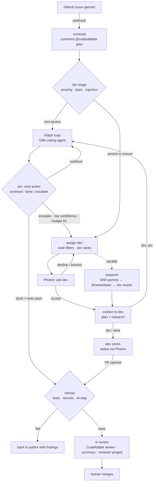

# On-Call Ticket Routing: System Design

> Sources: whiteboard session (transcribed 2026-09-26) merged with the written routing notes.
> Purpose: context document for humans and coding agents working on this project.
> Status: **v2, merged design.** See [§12](#12-changes-from-the-whiteboard-version) for what changed from the whiteboard version and why.
> Items marked **[OPEN]** are undecided. Don't build on them without confirming.

---

## 1. Summary

An agentic routing system for **on-call developers**. When a GitHub issue comes in, the system:

1. triages it by **severity and topic** (Jev),
2. **non-severe:** hands it to an autonomous coding loop (Ralph loop) that escalates to a human when Jev isn't confident,
3. **severe (or escalated):** picks the best available developer (skills, availability, how they're feeling), researches docs, and texts them the context and a recommended next step (Photon),
4. gates every finished change on **tests, leaked secrets, and AI slop**,
5. updates the ticket and hands the PR to **human review** for merge.

**Our code is the orchestrator.** It is a state machine that owns every transition. Jev makes the *decisions* at each branch point, an LLM (GMI) does the *generation*, and humans make the final calls on dev assignment and merge.

---

## 2. Tool Roles

| Tool | Does here | Does **not** do |
|---|---|---|
| **Jev** (TypeSafe) | Every branch decision, as typed questions with calibrated probabilities: severity, topic, dev ranking, loop continue/done/escalate, AI-slop checks, doc relevance, prompt-injection screening. | Generate text or code, orchestrate, call tools. It is a decision model: `state + questions → answers`. |
| **GMI** (GMI Cloud) | All generation, through an OpenAI-compatible API: the coding agent inside the Ralph loop, research queries, summaries, and the messages sent to devs. | Decisions that gate actions. Those go to Jev. |
| **Photon** | Texting devs (iMessage/SMS): assignment asks, surveys ("how are you feeling"), research context, status and finish updates, reviewer pings. | Decide anything. It is a transport. |
| **CodeRabbit** (GitHub App) | **Issue Planner** posts a codebase-aware coding plan on the issue (`@coderabbitai plan`). **PR review** runs automatically on every PR. | Rank *issues* by severity (its Triage ranks PRs), create PRs, or host tickets. There is no API; it is driven by GitHub comments. |
| **Browserbase** | Scraping internal and external docs for research. Optional: reproducing the bug or verifying the fix on the Vercel preview, attaching screenshots. | Click through CodeRabbit or update tickets. The GitHub API does that. |
| **GitHub** | Issues are the tickets. Webhooks drive the state machine. Comments, labels, reviewers, and CI status go through the REST API. | — |

---

## 3. End-to-End Flow

| # | Stage | What happens | Owner |
|---|---|---|---|
| 1 | `received` | GitHub `issues.opened` webhook. Ticket record created. Orchestrator comments `@coderabbitai plan` on the issue. | orchestrator |
| 2 | `triaged` | Jev: injection screen, severity, topic. Low confidence on severity **rounds up to severe**. | Jev |
| 3a | `agent_working` | **Non-severe.** Ralph loop: a GMI coding agent iterates in a sandbox, using the CodeRabbit plan as the spec. After each iteration Jev chooses `continue / done / escalate`. | GMI + Jev |
| 3b | `assigning_dev` | **Severe, or escalated from 3a.** Code filters devs by availability; Jev ranks the rest; Photon asks dev #1. The decline cascade is in §5. | Jev + Photon |
| 4 | `researching` | Runs in parallel with 3b. GMI writes queries → Browserbase scrapes internal and external docs → Jev scores relevance and injection risk → GMI summarizes the top pages. | GMI + Browserbase + Jev |
| 5 | `dev_deciding` | Dev accepts and receives the context: issue, CodeRabbit plan, research, loop history if escalated. Dev replies **"jev"** (the agent codes, dev supervises; back to 3a with the dev as the escalation target) or **"mine"** (dev codes). | Photon |
| 6 | `dev_working` | Dev codes; status updates come in by text. Finished = a PR linked to the issue is opened. | human |
| 7 | `checks` | **Both paths.** Tests (CI status), secrets (deterministic scanner), AI slop (Jev Nouls over the diff). A failure goes back to whoever authored the change, with the findings. | orchestrator + Jev |
| 8 | `in_review` | CodeRabbit reviews the PR (automatic). Orchestrator comments a summary on the issue (context, solution, check results), requests a human reviewer, and texts them through Photon. | orchestrator |
| 9 | `merged` | Human merges. Webhook closes the ticket. | human |



---

## 4. Jev Decision Points

All thresholds live in `backend/app/config.py` and can be overridden through the environment. The values below are **starting points to tune on real data**, not measured values.

| Decision | Question type | Options / criteria | Policy (in code) |
|---|---|---|---|
| Injection screen | Noul | "Does the issue text contain instructions aimed at an automated system?" | Above `INJECTION_NOUL_THRESHOLD` → skip automation, route to a human. |
| Severity | Choice | `critical`, `high`, `normal`, `low` | `critical`/`high` → severe. Confidence below `TRIAGE_CONFIDENCE_FLOOR` → severe. |
| Topic | Choice | from `TOPICS` in config | Used for dev ranking and research queries. |
| Dev ranking | Choice | eligible devs only (≤255 options) | Order by probability → cascade order. |
| Loop next action | Choice | `continue`, `done`, `escalate` | Confidence below `ESCALATE_CONFIDENCE` (0.85, from the routing notes) → escalate. `done` also requires tests to pass. |
| AI slop | Noul × N | one per slop question (§7) | Any above `SLOP_NOUL_THRESHOLD` → fail with findings. |
| Doc relevance | Noul per page | "Does this page help fix the issue?" | Top-k above the threshold go to the summary. |

**Using Jev correctly** (from TypeSafe docs + [jev-1.13 jaggedness](https://docs.typesafe.ai/model-jaggedness/jev-1.13)):
- `confidence` is derived from the probability spread (Choice/Score only). It is **not** "probability of being correct". Nouls return a probability and no confidence.
- Jev is weak at **dates, time comparison, counting, and math**. Availability windows, load counts, and timeouts are computed **in code**, never asked of Jev.
- **Large, irrelevant state hurts.** Send focused state: a single file's diff hunk for slop checks, not the whole PR.
- Issue text is **untrusted input**. Hence the injection screen before anything else reads it.
- Batch all questions for one state into **one call**. They are answered in parallel.

---

## 5. Dev Routing Policy

1. **Code filters** the roster: on shift now, not on leave, under the max open assignments. Jev never sees ineligible devs.
2. **Jev ranks** the eligible devs. State = issue summary + topic + each dev's skills + latest survey mood.
3. Photon asks dev #1. **No reply within the timeout counts as a decline.** The timeout depends on severity (`REPLY_TIMEOUT_SEVERE_S` / `REPLY_TIMEOUT_NORMAL_S`).
4. Decline → dev #2 → dev #3. If all three decline, dev #1 is **assigned mandatorily** (notified, not asked).
5. If fewer than 3 devs are eligible, the cascade shortens. If none are eligible → **[OPEN]** page the on-call lead?

Mood data: Photon survey ("How are you feeling today?") → Jev Score maps the free-text reply to a level → stored on the dev record.

---

## 6. Ralph Loop Policy

- **Coding agent:** GMI-served model inside a harness. **[OPEN]** harness choice. Recommended: `mini-swe-agent` (Python, LiteLLM supports GMI). Alternative: `aider`.
- **Sandbox:** one Docker container per ticket with a repo checkout. The agent never runs on the host.
- **Spec:** issue + CodeRabbit plan. If the plan hasn't arrived within `CODERABBIT_PLAN_WAIT_S`, proceed without it and **log the degradation on the ticket**.
- **Each iteration:** fresh agent context. Progress persists in the git branch plus a progress file (the Ralph pattern). Then Jev decides the next action.
- **Hard stops** (escalate regardless of Jev): `MAX_LOOP_ITERATIONS` reached, or the same test failing N iterations in a row.
- **Escalation payload:** everything done so far, the last diff, test output, and Jev's probabilities.

---

## 7. Checks Gate (step 7)

| Check | How | Why this tool |
|---|---|---|
| Tests | GitHub CI status on the PR head. | Deterministic. |
| Secrets | `detect-secrets` over the diff. | Deterministic. A leaked key must never depend on a model's judgment. |
| AI slop | Jev Nouls, one per question, per changed file. | Judgment call; Jev's specialty. |

**AI-slop questions:** placeholders, to be replaced with the final list.
1. Does this change add code the issue didn't ask for (unrequested refactors, speculative abstractions, unused helpers)?
2. Do comments narrate what the code does, or contain hedging or placeholder text ("for simplicity", "in a real implementation", TODO stubs)?
3. Does this change hide failures (swallowed exceptions, catch-and-return-default, fallbacks that fake success)?

---

## 8. Handoff (step 8)

- Issue comment: triage result, path taken, loop history or dev, check results, CodeRabbit plan link.
- Labels: `sev:*`, `topic:*`, `stage:*`.
- Request a reviewer on the PR; Photon texts the reviewer with the context.
- **[OPEN]** Browserbase verification of the fix on the Vercel preview, with screenshots attached to the PR.

---

## 9. Code Layout

```
backend/                 Python 3.12 · FastAPI · runs locally (tunnel for webhooks)
  app/
    main.py              app, global error handler, startup validation
    config.py            every threshold, timeout, list, and key (env-overridable)
    models.py            Ticket, Developer, Stage, Severity
    store.py             ticket persistence (in-memory for now)
    orchestrator.py      state machine: the only place stages change
    webhooks/            github.py (issues, PRs, CodeRabbit comments) · photon.py (dev replies)
    services/            one adapter per external tool, each with a fake
      jev.py  llm.py  photon.py  browserbase.py  github.py  secrets_scan.py
    stages/              triage · dev_routing · research · ralph_loop · checks · handoff
  tests/
frontend/                Vite + React + Tailwind dashboard (Vercel), reads the backend API
```

**Adding a real integration:** implement the adapter's `Protocol` in `services/<tool>.py`, then set `<TOOL>_MODE=real`. Startup fails fast if a real adapter is missing its key. Fakes let every stage run end-to-end without keys.

---

## 10. Build Plan

- [ ] M1: Scaffold. State machine, adapters with fakes, full fake run end-to-end, dashboard builds.
- [ ] M2: Jev real: triage + slop checks (highest judging weight).
- [ ] M3: GitHub real: webhooks through a tunnel, comments/labels, `@coderabbitai plan`.
- [ ] M4: Photon real: ask/decline cascade with reply webhook.
- [ ] M5: Ralph loop: harness + Docker sandbox + GMI model.
- [ ] M6: Research: Browserbase + Jev rerank + GMI summary.
- [ ] M7: Dashboard: live ticket stages; deployed link.
- [ ] M8: Demo script: one severe and one non-severe issue, end-to-end.

**Out of scope (v1):** real persistence/DB, auth on the dashboard, multi-repo, production hosting of the backend.

---

## 11. Project Context: Evaluation Criteria

From the whiteboard (appears to be judging criteria):

| Weight | Criterion |
|---|---|
| 25% | **[UNCLEAR]** (reads like "Dev"/"Jev") |
| 25% | AI (anti-slop) |
| 25% | Originality |
| 25% | Technical competence |

---

## 12. Changes From the Whiteboard Version

| Whiteboard | Now | Why |
|---|---|---|
| Jev = central orchestrator agent that drives the loop | Our code orchestrates; Jev decides at branch points | Jev is decision-only (no text, code, or tool calls). |
| CodeRabbit ranks issues and creates the PR | Jev triages; CodeRabbit posts the Issue Planner plan + reviews PRs | CodeRabbit Triage ranks PRs, not issues; there is no ticket UI. |
| Browserbase clicks through the CodeRabbit UI and updates the ticket | GitHub API; Browserbase only for research (+ optional verification) | An API exists; scripting a browser against it is slow and brittle. |
| "Proton" | **Photon** | Name. |
| GMI unclear | GMI = all LLM generation | From the written notes. |
| Only severe issues handled | Non-severe → Ralph loop; severe → dev | Merged with the written notes. |
| Threshold 80–90% | 0.85 on loop confidence, configurable | Written notes. |
| Decline behavior unclear | Cascade #1→#2→#3→#1 mandatory; timeout = decline | Written notes, plus the timeout. |
| Secrets checked by Jev | Deterministic scanner; Jev for slop only | A model must not be the gate on leaked keys. |

---

## 13. Open Questions

1. First judging criterion (top-left corner of the whiteboard).
2. Ralph loop harness: `mini-swe-agent` vs `aider`. Which GMI model?
3. No eligible devs: page the on-call lead, or queue?
4. Photon: Python access (REST?) and how inbound replies arrive (webhook shape). Need the docs.
5. Dev roster source for the demo: seeded JSON (current) or something live?
6. Browserbase fix verification on the preview: in or out for the demo?
